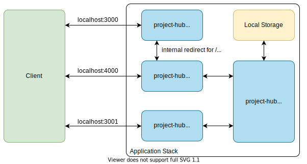

Project Hub is a self-hosted project and information management service for companies, organizations or other types of Groups. The goal of this project is to develop an application which makes is possible to create, manage and simply customize individual project dashboards by adding removing and dragging widgets on a grid. One of the top priorities is the ability to freely choose and flexibly change the content of the dashboard and its arrangement to match the project needs.

The Platform is intended as an augmentation and overview of your projects and their resources. Every project represented inside Project-Hub has a unique dashboard-like-grid where you can place widgets. These widgets can range from ToDo lists to external data visualization like Merge-Requests of your GitLab project. You decide what matters and should be displayed on the grid!

Because most projects are handled by Teams and not individuals, Project-Hub has a deep integration of user and role features. You can share project dashboards with colleagues and collaborate together on them. Furthermore you have the ability to decide how much control you want to give individual members inside your project. Simply change the user role to read-only so an user can't mess up your carefully crafted dashboard :).

If you are not convinced already, here is a link to a [demo](https://project-hub.studio) where you can test all the mentioned features. You can create a new account or use the following credentials:

E-Mail: demo@example.org

Password: P@ssw0rd

## Table of contents

1. [Quick Start Guide](#quick-start-guide)
2. [Architecture](#architecture)
3. [Project Structure](#project-structure)
4. [Deployment Guide](#deployment-guide)
5. [Developer Guide](#developer-guide)
6. [API Documentation](#api-documentation)
7. [License](#license)

## Quick Start Guide

This quick-start guide demonstrates how to set up and start a Project-Hub instance using docker-compose. This Tutorial is intended for a single node deployment setup. If you want to start the application in a production environment use the dedicated [Deployment Guide](#deployment-guide).

Requirements:

- Docker
- docker-compose

1. Download/Clone the Project on to your target system.

   ```bash
   git clone https://code.fbi.h-da.de/project-hub/project-hub.git
   ```

2. Create an `.env` environment file to configure the backend. You can start of by using the default values provided by the project. Simply copy the `.env.example` file and change them to your needs. **Warning: Don't use the default values in an production scenario!**

   ```bash
   cp ./packages/backend/.env.example ./packages/backend/.env
   ```

3. Install all necessary backend dependencies using the following docker-compose command inside your project root directory.

   ```bash
   docker-compose run backend npm install
   ```

4. Install all necessary frontend dependencies using the following docker-compose command inside your project root directory.

   ```bash
   docker-compose run frontend npm install
   ```

5. After all dependencies have been installed you can start the application stack using the following command:

   ```bash
   docker-compose up -d
   ```

   Using the `docker-compose ps` command should result in a output similar to this one:

   ```
            Name                       Command               State                       Ports
   ----------------------------------------------------------------------------------------------------------------
   project-hub_backend_1    docker-entrypoint.sh npm start   Up      0.0.0.0:4000->4000/tcp, 0.0.0.0:9929->9929/tcp
   project-hub_db_1         docker-entrypoint.sh --cha ...   Up      0.0.0.0:3306->3306/tcp, 33060/tcp
   project-hub_frontend_1   docker-entrypoint.sh npm start   Up      0.0.0.0:3000->3000/tcp
   project-hub_notes_1      docker-entrypoint.sh node  ...   Up      0.0.0.0:3001->9001/tcp
   ```

6. The backend does not synchronize the database schema with the MySQL database. This is by design, so you don't mess up your existing project-hub data when restating the docker-compose stack. On the first start of the application stack you have to manually synchronize the database by using the following command:

7. ```bash
   docker-compose exec backend npm run typeorm schema:sync
   ```

8. Enjoy your new project-hub instance under `http://localhost:3000`

## Architecture

Project-Hub consists of a React frontend and a Node.js backend. The minimal version also ships with etherpad out-of-the-box to enable the notes widget. To persist changes made by the backend as well as etherpad, a MySQL database is used. The shown architecture in the following image only applies to the development setup. If you want to learn more about the deployment architecture for Kubernetes or docker-compose visit one of the following links. [Deploy Project-Hub using docker-compose](./deploy/docker-compose/README.md) or [Deploy Project-Hub using Kubernetes](./deploy/kubernetes/README.md)



## Project Structure

```
├───db                                | everything related to the database
├───deploy                            | available deployment methods
│   ├───docker-compose                | deployment files for a production ready instance using docker-compose
│   └───kubernetes                    | deployment files for a production ready instance using Kubernetes
├───docs                              | all relevant files for the documentation
├───packages                          | all source code of the main application should be inside this folder
│   ├───backend                       | source code for backend
│   │   ├───src                       |
│   │   │   ├───controller            |
│   │   │   ├───entity                |
│   │   │   ├───fixture               |
│   │   │   ├───middleware            |
│   │   │   ├───router                |
│   │   │   ├───util                  |
│   │   │   ├───widgets               |
│   │   │   └───index.ts              | entrypoint for backend
│   │   ├───test                      | backend tests
│   │   ├───...                       |
│   ├───frontend                      | source code for frontend
│   │   ├───public                    |
│   │   ├───src                       |
│   │   │   ├───components            |
│   │   │   ├───hooks                 |
│   │   │   ├───models                |
│   │   │   ├───pages                 |
│   │   │   ├───utils                 |
│   │   │   ├───widgets               |
│   │   │   └───index.ts              | entrypoint for frontend
│   │   ├───...                       |
├───widgets                           | additional components for widgets that don't belong strictly to the frontend
├───...                               |
```

## Deployment Guide

To deploy a production ready version of Project-Hub you have two officially supported options:

The following Guides help you set up a production ready Project-Hub instance and show the respective architecture.

- [Deploy using docker-compose](./deploy/docker-compose/README.md)
- [Deploy for Kubernetes](./deploy/kubernetes/README.md)

## Developer Guide

If you want to contribute or want to tinker with this project, use [this guide](./docs/developer-guide.md) that helps you set up your development environment.

**further content:**

- Required Tools
- Development Environment Setup
- Testing
- Code Style and Linting

To develop your own Widget for Project-Hub there is [this](./docs/how-to-create-widgets.md) Tutorial.

If you want to get more insides into the data management you can take a look at the [Database Information and Schema](./db/README.md) document.

## API Documentation

The Project uses the [OpenAPI V3 Specification](http://spec.openapis.org/oas/v3.0.3). The Documentation file can be can be found [here](./docs/openapi.json).

## License

This project is licensed under the MIT License.

For more information see the [LICENSE](./LICENSE) file or visit the [official site](https://spdx.org/licenses/MIT.html) of the MIT License.
