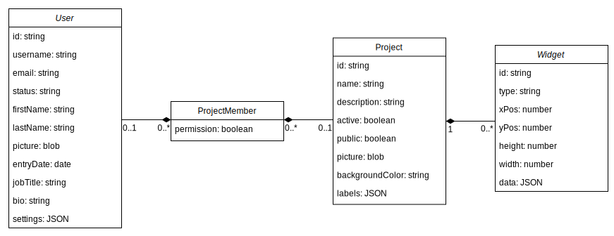

# Database Information and Schema

This document contains necessary information for managing the Project-Hub database.

## Table of contents

1. [Change the Database Engine](#change-the-database-engine)
2. [Database Schema](#database-schema)

## Database Schema

## Change the Database Engine

Project-Hub by default uses a MySQL database to store all its data. If you want to change to a different Database Engine you can chose one of the databases listed on [TypeORM](https://typeorm.io/#/connection-options). **Note: We don't officially support database engines other than MySQL. Do this at your own risk!**

You have to change the following file accordingly and build the docker-images to match your changes.

- `./packages/backend/ormconfig.js`
- `./widgets/notes/settings.json`
