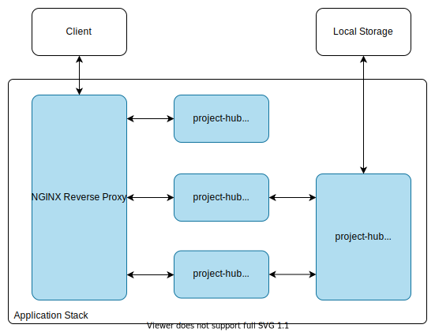

# docker-compose Deployment

This Guide helps you deploy Project-Hub using docker-compose.

## Table of contents

1. [Requirements](#requirements)
2. [Architecture](#architecture)
3. [Installation](#installation)

## Requirements

- You should have Docker installed on your target system
- You should have docker-compose installed on your target system
- Docker container should be able to connect to the Internet

## Architecture

The application consists of the following parts:

- frontend
- backend
- mysql database (with persistant storage)
- notes (etherpad)

The following diagram describes the Architecture when deploying the docker-compose stack.



## Installation

_Attention: Before you deploy the application stack, make sure you are using the correct docker-images. By default the frontend targets the `http://project-hub.studio` domain. You should configure it and rebuild as necessary._

To deploy using docker-compose you can use the following command.

```bash
docker-compose up
```

list all containers

```bash
docker-compose ps
```

After all pods have started, you have to create the database schema.

```bash
docker-compose exec backend npm run typeorm schema:sync
```

If you have to log into the mysql database you an use the following command:

```bash
docker-compose exec db mysql -u root -p
```

To remove the application you can use the following commands

```bash
docker-compose down
```
