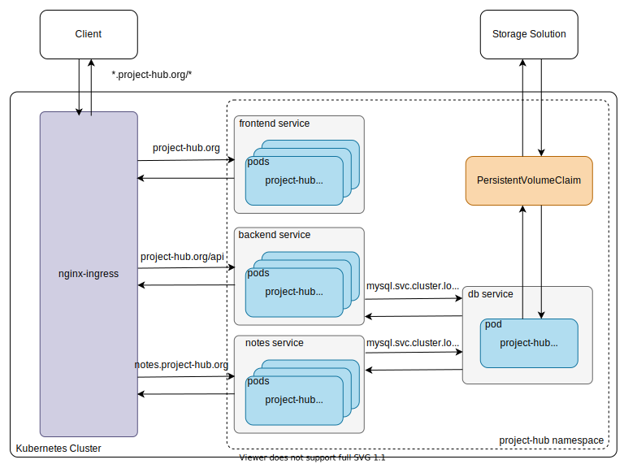

# Kubernetes Deployment

Project-Hub has first level support for operating inside a Kubernetes Cluster. This Guide helps you deploying the application to a running Cluster and describes the Architecture.

## Table of contents

1. [Requirements](#requirements)
2. [Architecture](#architecture)
3. [Installation](#installation)
4. [Upgrading to a new Version](#upgrading-to-a-new-version)

## Requirements

- Your Kubernetes cluster should be able to fetch from the container registry of this Repository
- Your Kubernetes cluster should have an running ingress controller (testet with: nginx-ingress)
- You should configure the `project-hub-ingress.yaml` file to match your target domain.

## Architecture

The application consists of the following parts:

- frontend
- backend
- mysql database (with persistant storage)
- notes (etherpad)
- ingress for project-hub.studio & notes.project-hub.studio

The following diagram describes the Architecture when deploying to Kubernetes. Project-Hub uses a dedicated namespace called "project-hub". The frontend, backend and notes service can be scaled.



## Installation

Info: To deploy this stack you have to have the cluster-admin ClusterRole, because the mysql persistant storage allocation needs cluster type accesss.

To deploy to kubernetes you can use the following command.
The deployment uses [kustomize](https://kustomize.io/) which is build in to kubectl since version v1.14.

```bash
kubectl apply -k ./deploy/kubernetes/
```

Watch the pods start

```bash
kubectl -n project-hub get pods --watch
```

After all pods have started, you have to create the database schema.

```bash
kubectl -n project-hub exec $(kubectl -n project-hub get pod -l app=backend -o jsonpath="{.items[0].metadata.name}") --  npm run typeorm schema:sync
```

All data is stored in the `/mnt/project-hub/` folder. If the Application should crash you can restart the stack.
The new database pod uses the existing persistant storage.

If you have to log into the mysql database you an use the following command:

```bash
kubectl -n project-hub run -it --rm --image=mysql:5.6 --restart=Never mysql-client -- mysql -h mysql -u root -pP@ssw0rd
```

To remove the application you can use the following commands

```bash
kubectl delete -n project-hub ing -l ref=project-hub
kubectl delete -n project-hub all -l ref=project-hub
kubectl delete namespace project-hub
```

## Upgrading to a new Version

To upgrade a running version of Project-Hub to a newer version you can use Kubernetes build in features.

Simply update the manifest file to the desired version and reapply them using kustomize.

```bash
kubectl apply -k ./deploy/kubernetes/
```

Kubernetes automatically detects the modified files and redeploys changed objects. Your persistent data is not affected by this update.
